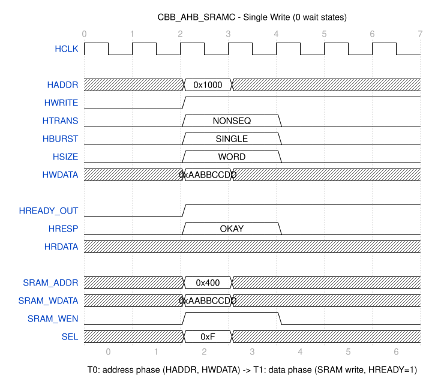
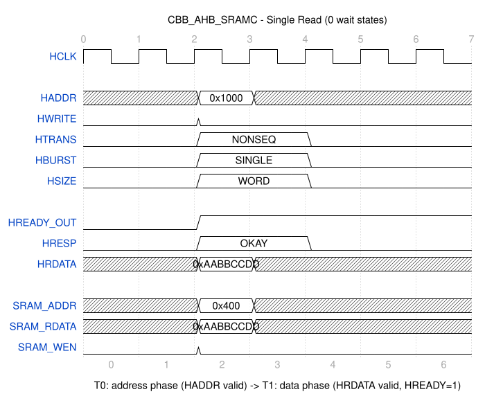
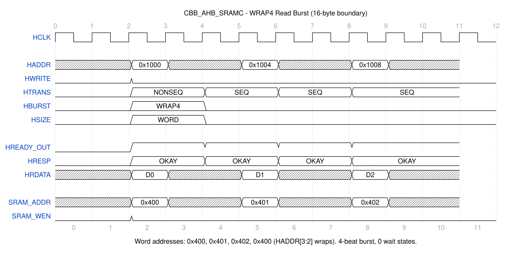
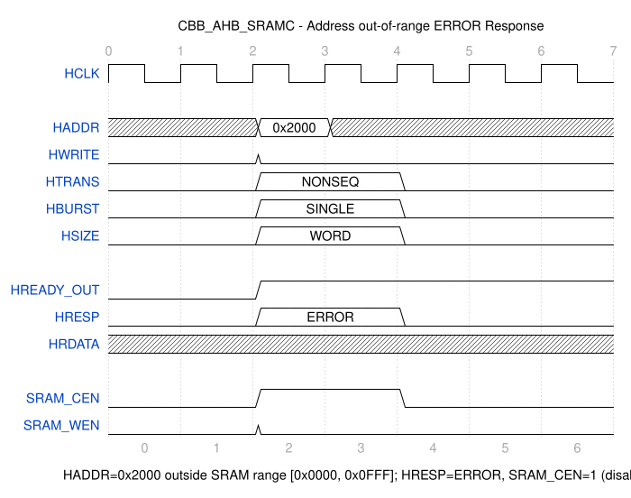

# CBB_AHB_SRAMC_UG

---

## 目录

- [1. 功能及应用场景](#1-功能及应用场景)
- [2. 规格](#2-规格)
- [3. 方案分析](#3-方案分析)
- [4. 配置参数](#4-配置参数)
- [5. 接口](#5-接口)
- [6. 时序图](#6-时序图)
- [7. PPA](#7-ppa)

---

## 1. 功能及应用场景

`CBB_AHB_SRAMC` 是一个参数化的 **AHB-Lite 从设备到 SRAM 控制器（AHB to SRAM Controller）**，提供 AHB-Lite 总线协议到同步 SRAM 接口的桥接功能。模块支持完整的 AHB 传输类型，包括单次传输和多种 burst 模式，并自动生成 SRAM 地址、写使能、字节选择等控制信号。

**核心功能：**

| 功能 | 说明 |
|------|------|
| AHB-Lite 从设备接口 | 32-bit 数据总线，32-bit 地址总线，符合 AMBA 2.0 AHB-Lite 规范 |
| SRAM 控制 | 输出 SRAM 地址、写使能、字节选通信号，兼容同步单端口 SRAM |
| 单次传输 (SINGLE) | 支持单次读写访问 |
| 增量 burst (INCR) | 支持不定长增量 burst，含 1KB 地址边界保护 |
| 回绕 burst (WRAP4/8/16) | 支持 4/8/16 拍回绕 burst |
| 定长增量 burst (INCR4/8/16) | 支持 4/8/16 拍定长增量 burst |
| 字节写使能 | 根据 HADDR[1:0] 和 HSIZE 自动生成 4-bit byte select 信号 |
| 错误响应 | 地址越界时返回 HRESP = ERROR |
| 流水线控制 | 1-stage 流水线，数据相位后一拍完成 SRAM 访问 |

**典型应用场景：**

- SoC 中 AHB-Lite 总线到片上 SRAM 的桥接
- 低延迟、高吞吐量的嵌入式存储控制器
- 需要 AHB 总线接口的 SRAM 子系统

**产品边界：**

- 不包含 SRAM 存储阵列本身（仅输出控制信号）
- 不包含 ECC 或奇偶校验逻辑
- 不包含时钟门控或低功耗模式控制
- 不包含 AHB 多主设备仲裁（仅支持 AHB-Lite 单主设备）

---

## 2. 规格

### 规格汇总

| DS 编号 | 规格项 | 类型 | 简述 |
|---------|--------|------|------|
| DS.CBB_AHB_SRAMC.FUNC.001 | 单次读传输 | FUNC | 支持 SINGLE 类型读操作，返回 SRAM 数据 |
| DS.CBB_AHB_SRAMC.FUNC.002 | 单次写传输 | FUNC | 支持 SINGLE 类型写操作，写入 SRAM |
| DS.CBB_AHB_SRAMC.FUNC.003 | 增量 burst 读/写 | FUNC | 支持 INCR 类型 burst，连续地址递增 |
| DS.CBB_AHB_SRAMC.FUNC.004 | 定长增量 burst 读/写 | FUNC | 支持 INCR4/INCR8/INCR16 定长 burst |
| DS.CBB_AHB_SRAMC.FUNC.005 | 回绕 burst 读/写 | FUNC | 支持 WRAP4/WRAP8/WRAP16 地址回绕 |
| DS.CBB_AHB_SRAMC.FUNC.006 | 字节写使能 | FUNC | 根据 HSIZE 和 HADDR[1:0] 生成 SEL[3:0] |
| DS.CBB_AHB_SRAMC.FUNC.007 | 错误响应 | FUNC | 地址越界时返回 ERROR |
| DS.CBB_AHB_SRAMC.FUNC.008 | 1KB 边界保护 | FUNC | INCR burst 不跨越 1KB 地址边界 |
| DS.CBB_AHB_SRAMC.FUNC.009 | HTRANS 传输类型 | FUNC | 支持 IDLE/BUSY/NONSEQ/SEQ 传输类型 |
| DS.CBB_AHB_SRAMC.INTF.001 | AHB-Lite 接口 | INTF | 符合 AMBA 2.0 AHB-Lite 从设备接口规范 |
| DS.CBB_AHB_SRAMC.INTF.002 | SRAM 接口 | INTF | 输出 SRAM 地址/数据/控制信号 |
| DS.CBB_AHB_SRAMC.CFG.001 | SRAM 深度可配置 | CFG | SRAM_ADDR_WIDTH 参数化地址位宽 |
| DS.CBB_AHB_SRAMC.CFG.002 | SRAM 基地址可配置 | CFG | BASE_ADDR 和 ADDR_MASK 参数化地址译码 |
| DS.CBB_AHB_SRAMC.CFG.003 | 字节写使能配置 | CFG | BYTE_ENABLE 参数化字节写使能 |
| DS.CBB_AHB_SRAMC.PERF.001 | 0 等待状态 | PERF | 单周期 SRAM 访问，HREADY 无插入等待 |
| DS.CBB_AHB_SRAMC.PERF.002 | 1 级流水线 | PERF | 地址相位后一拍完成数据相位 |

### 2.1 单次读传输 — DS.CBB_AHB_SRAMC.FUNC.001

当 `HTRANS = NONSEQ`、`HWRITE = 0`、`HSEL = 1` 且地址在有效范围内时，控制器执行单次读操作。地址相位采样 HADDR，数据相位从 SRAM 读取数据并驱动到 HRDATA。

### 2.2 单次写传输 — DS.CBB_AHB_SRAMC.FUNC.002

当 `HTRANS = NONSEQ`、`HWRITE = 1`、`HSEL = 1` 且地址在有效范围内时，控制器执行单次写操作。使用 HWDATA 和自动生成的 SEL[3:0] 写入 SRAM。

### 2.3 增量 burst — DS.CBB_AHB_SRAMC.FUNC.003

当 `HBURST = INCR` 时，执行不定长增量 burst。首拍 `HTRANS = NONSEQ`，后续拍 `HTRANS = SEQ`。地址按 `HSIZE` 指定的字节数递增。支持 1KB 地址边界保护：当地址跨过 1KB 边界时，HREADY 仍保持高但控制器将此次访问视为新地址范围的访问。

### 2.4 定长增量 burst — DS.CBB_AHB_SRAMC.FUNC.004

| HBURST | 传输长度 | 地址递增方式 |
|--------|----------|-------------|
| INCR4  | 4 拍     | 每拍按 HSIZE 递增 |
| INCR8  | 8 拍     | 每拍按 HSIZE 递增 |
| INCR16 | 16 拍    | 每拍按 HSIZE 递增 |

### 2.5 回绕 burst — DS.CBB_AHB_SRAMC.FUNC.005

| HBURST | 回绕边界 | 地址位回绕 |
|--------|----------|-----------|
| WRAP4  | 16 字节 (4 字) | HADDR[3:2] 回绕 |
| WRAP8  | 32 字节 (8 字) | HADDR[4:2] 回绕 |
| WRAP16 | 64 字节 (16 字) | HADDR[5:2] 回绕 |

回绕 burst 的起始地址必须与回绕边界对齐，否则行为未定义。回绕地址由 AHB 主设备驱动，控制器仅透明传输地址到 SRAM。

### 2.6 字节写使能 — DS.CBB_AHB_SRAMC.FUNC.006

对于 32-bit 数据总线，`SEL[3:0]` 对应 4 个字节通道：

| HSIZE | HADDR[1:0] | SEL[3:0] | 有效字节 |
|-------|------------|----------|---------|
| BYTE (00) | 00 | 0001 | [7:0] |
| BYTE (00) | 01 | 0010 | [15:8] |
| BYTE (00) | 10 | 0100 | [23:16] |
| BYTE (00) | 11 | 1000 | [31:24] |
| HALFWORD (01) | 00 | 0011 | [15:0] |
| HALFWORD (01) | 10 | 1100 | [31:16] |
| WORD (10) | 00 | 1111 | [31:0] |

### 2.7 错误响应 — DS.CBB_AHB_SRAMC.FUNC.007

当 HADDR 不在 `[BASE_ADDR, BASE_ADDR + SRAM_SIZE)` 范围内时，控制器返回 `HRESP = ERROR`，`HREADY = 1`。写操作不写入 SRAM，读操作返回的 HRDATA 未定义。

### 2.8 1KB 边界保护 — DS.CBB_AHB_SRAMC.FUNC.008

INCR burst 在地址跨过 1KB 边界时，控制器自动终止当前 burst 序列。SEQ 传输中地址跨过 1KB 边界时，控制器将 HREADY 置为高并完成当前传输，但不保证后续地址的连续性——主设备应将此视为 burst 结束。

### 2.9 HTRANS 传输类型 — DS.CBB_AHB_SRAMC.FUNC.009

| HTRANS | 名称 | 控制器行为 |
|--------|------|-----------|
| 00 | IDLE | 空闲周期，不执行 SRAM 访问 |
| 01 | BUSY | 忙周期，主设备插入忙等待，控制器不执行 SRAM 访问 |
| 10 | NONSEQ | 非连续传输，AHB 突发首拍，控制器执行 SRAM 访问 |
| 11 | SEQ | 连续传输，AHB 突发后续拍，控制器执行 SRAM 访问 |

### 2.10 参数化配置 — DS.CBB_AHB_SRAMC.CFG.001~003

SRAM 深度通过 `SRAM_ADDR_WIDTH` 配置，默认 10（1024 字）。基地址译码通过 `BASE_ADDR` 和 `ADDR_MASK` 配置。字节写使能通过 `BYTE_ENABLE` 参数开启/关闭。

### 2.11 性能 — DS.CBB_AHB_SRAMC.PERF.001~002

- 0 等待状态：对于单周期 SRAM，HREADY 在数据相位始终为高
- 1 级流水线：地址相位到数据相位延迟 1 个时钟周期

---

## 3. 方案分析

### 3.1 核心原理

`CBB_AHB_SRAMC` 的核心是一个 AHB-Lite 从设备状态机，将 AHB 总线协议转换为同步 SRAM 控制信号。模块在 AHB 地址相位采样地址和控制信号，在数据相位驱动 SRAM 控制并返回数据。

### 3.2 数据处理流程

```text
AHB 主设备                              AHB-SRAMC                          SRAM
  │                                       │                                 │
  │  ── HADDR/HCTRL ──────────────────→  │  ── SRAM_ADDR ────────────────→ │
  │  ── HWDATA ───────────────────────→  │  ── SRAM_WDATA/SEL ───────────→ │
  │  ←─ HRDATA/HREADY/HRESP ──────────  │  ←─ SRAM_RDATA ──────────────── │
  │  ←─ HREADY ────────────────────────  │                                 │
```

### 3.3 硬件架构设计

```
                                  ┌──────────────────────────────────────────────────────┐
                                  │                   CBB_AHB_SRAMC                       │
                                  │                                                       │
   HCLK ────────────────────────→│                                                        │
   HRESETn ─────────────────────→│                                                        │
                                  │  ┌─────────────┐    ┌──────────────┐    ┌───────────┐  │
   HSEL ────────────────────────→│──│  地址译码    │───→│              │    │           │  │──→ SRAM_ADDR
   HADDR[31:0] ─────────────────→│──│  (BASE_ADDR  │    │   控制      │    │  地址     │  │──→ SRAM_WDATA
   HWRITE ─────────────────────→│──│   & MASK)    │    │   状态机    │    │  寄存器   │  │──→ SRAM_WEN
   HTRANS[1:0] ────────────────→│──│              │    │  (FSM)      │    │           │  │──→ SEL[3:0]
   HBURST[2:0] ────────────────→│──│  ERROR if    │    │              │    │           │  │
   HSIZE[1:0] ─────────────────→│──│  out-of-range│    │  IDLE       │    │           │  │
   HWDATA[31:0] ───────────────→│──│              │    │  ACCESS     │    │           │  │
                                  │  └─────────────┘    │  ERROR      │    └───────────┘  │
                                  │                      └──────┬───────┘                 │
   HREADY_OUT ───────────────────│←──────────────────────────────┘                       │
   HRESP[1:0] ──────────────────│←───────────────────────────────────────────────────────│
   HRDATA[31:0] ←───────────────│←─── SRAM_RDATA (registered)                            │
                                  │                                                       │
                                  └──────────────────────────────────────────────────────┘
```

### 3.4 状态机设计

```
                    ┌──────────────────────────────────────┐
                    │                                      │
                    │          RESET / IDLE                │
                    │    HREADY = 1, HRESP = OKAY          │
                    │                                      │
                    └──────┬───────────────────────────────┘
                           │
                           │ HSEL && (HTRANS == NONSEQ || HTRANS == SEQ)
                           │ && address in range
                           ▼
                    ┌──────────────────────────────────────┐
                    │              ACCESS                   │
                    │    1. 驱动 SRAM 地址和控制信号        │
                    │    2. 读：采样 SRAM 数据              │
                    │    3. 写：写入 SRAM  + byte enable    │
                    │    4. HREADY = 1, HRESP = OKAY        │
                    │                                      │
                    └──────┬───────────────────────────────┘
                           │
              ┌────────────┼────────────┐
              │            │            │
              ▼            ▼            ▼
     ┌──────────────┐ ┌──────────┐ ┌──────────┐
     │ 回到 IDLE    │ │ 继续     │ │ 回到     │
     │ (SINGLE /   │ │ ACCESS   │ │ IDLE     │
     │ burst 结束) │ │ (SEQ)    │ │ (ERROR)  │
     └──────────────┘ └──────────┘ └──────────┘
```

**状态说明：**

| 状态 | 描述 |
|------|------|
| **IDLE** | 空闲状态。HREADY = 1，HRESP = OKAY。等待 HSEL 且 HTRANS 不为 IDLE 时启动传输。当地址越界时直接进入 ERROR 状态。 |
| **ACCESS** | 访问状态。驱动 SRAM 接口信号，一个周期后完成 SRAM 访问。对于 burst 传输，持续跟踪地址递增和传输计数，直到 burst 结束或地址越界。 |
| **ERROR** | 错误状态。返回 HRESP = ERROR，HREADY = 1。下一周期回到 IDLE。 |

### 3.5 地址译码逻辑

```verilog
// 地址范围判断
wire addr_valid = (HADDR & ~ADDR_MASK) == (BASE_ADDR & ~ADDR_MASK);
wire [SRAM_ADDR_WIDTH-1:0] sram_addr = HADDR[SRAM_ADDR_WIDTH+1:2];  // 字地址
```

`BASE_ADDR` 和 `ADDR_MASK` 共同定义 SRAM 的地址窗口。`ADDR_MASK` 中为 1 的位表示可配置的地址位，为 0 的位表示固定位。

### 3.6 字节选通逻辑

```verilog
// 根据 HSIZE 和 HADDR[1:0] 生成字节选通
always_comb begin
    case ({HSIZE, HADDR[1:0]})
        {2'b00, 2'b00}: sel = 4'b0001;  // BYTE, offset 0
        {2'b00, 2'b01}: sel = 4'b0010;  // BYTE, offset 1
        {2'b00, 2'b10}: sel = 4'b0100;  // BYTE, offset 2
        {2'b00, 2'b11}: sel = 4'b1000;  // BYTE, offset 3
        {2'b01, 2'b00}: sel = 4'b0011;  // HALFWORD, offset 0
        {2'b01, 2'b10}: sel = 4'b1100;  // HALFWORD, offset 2
        {2'b10, 2'b00}: sel = 4'b1111;  // WORD, offset 0
        default:        sel = 4'b0000;
    endcase
end
```

### 3.7 工作示例

**示例 1：单次写操作**
```
HADDR = 0x1000, HWDATA = 0xAABBCCDD, HSIZE = WORD, HWRITE = 1
→ SRAM_ADDR = 0x400, SRAM_WDATA = 0xAABBCCDD, SEL = 4'b1111, SRAM_WEN = 1
```

**示例 2：WRAP4 读操作**
```
起始 HADDR = 0x1008 (字地址 0x402)
Beat 0: HADDR = 0x1008 → SRAM_ADDR = 0x402
Beat 1: HADDR = 0x100C → SRAM_ADDR = 0x403
Beat 2: HADDR = 0x1000 → SRAM_ADDR = 0x400 (回绕)
Beat 3: HADDR = 0x1004 → SRAM_ADDR = 0x401
```

---

## 4. 配置参数

| 参数 | 配置范围 | 默认值 | 描述 |
|------|----------|--------|------|
| `SRAM_ADDR_WIDTH` | 1~20 | 10 | SRAM 地址位宽，SRAM 深度 = 2^SRAM_ADDR_WIDTH 字 |
| `BASE_ADDR` | 32-bit 任意值 | 32'h0000_0000 | SRAM 基地址（字节地址） |
| `ADDR_MASK` | 32-bit 任意值 | 32'hFFFF_FC00 | 地址掩码，与 BASE_ADDR 共同决定地址窗口 |
| `BYTE_ENABLE` | 0/1 | 1 | 是否启用字节写使能（1=启用，0=全字写入） |
| `PIPELINE_STAGES` | 1 | 1 | 流水线级数（当前仅支持 1 级） |

**参数说明：**

- `SRAM_ADDR_WIDTH`：SRAM 地址线宽度。默认 10 → 1024 字 × 4 字节 = 4KB。最大值 20 → 1M 字 × 4 字节 = 4MB。
- `BASE_ADDR` 和 `ADDR_MASK`：地址译码配置。地址匹配条件为 `(HADDR & ~ADDR_MASK) == (BASE_ADDR & ~ADDR_MASK)`。
- `BYTE_ENABLE`：设为 0 时，所有写操作使用 SEL = 4'b1111，忽略 HSIZE 和 HADDR[1:0] 的字节选择。
- 非法参数组合（如 `SRAM_ADDR_WIDTH=0`）通过非综合参数检查终止仿真。

---

## 5. 接口

### 5.1 AHB-Lite 从设备接口

| 信号名 | 位宽 | I/O | 时钟域 | 描述 |
|--------|------|-----|--------|------|
| `HCLK` | 1 | I | — | AHB 总线时钟 |
| `HRESETn` | 1 | I | HCLK | 异步复位，低有效 |
| `HSEL` | 1 | I | HCLK | 从设备选择 |
| `HADDR` | 32 | I | HCLK | 地址总线（字节地址） |
| `HWRITE` | 1 | I | HCLK | 写使能（1=写，0=读） |
| `HTRANS` | 2 | I | HCLK | 传输类型：00=IDLE, 01=BUSY, 10=NONSEQ, 11=SEQ |
| `HSIZE` | 3 | I | HCLK | 传输大小：000=BYTE(8bit), 001=HALFWORD(16bit), 010=WORD(32bit) |
| `HBURST` | 3 | I | HCLK | Burst 类型：000=SINGLE, 001=INCR, 010=WRAP4, 011=INCR4, 100=WRAP8, 101=INCR8, 110=WRAP16, 111=INCR16 |
| `HPROT` | 4 | I | HCLK | 保护控制（本模块不使用） |
| `HWDATA` | 32 | I | HCLK | 写数据总线 |
| `HRDATA` | 32 | O | HCLK | 读数据总线 |
| `HREADY_OUT` | 1 | O | HCLK | 从设备准备好信号（高=完成传输） |
| `HRESP` | 2 | O | HCLK | 响应信号：00=OKAY, 01=ERROR |

### 5.2 SRAM 接口

| 信号名 | 位宽 | I/O | 时钟域 | 描述 |
|--------|------|-----|--------|------|
| `SRAM_ADDR` | SRAM_ADDR_WIDTH | O | HCLK | SRAM 地址（字地址） |
| `SRAM_WDATA` | 32 | O | HCLK | SRAM 写数据 |
| `SRAM_RDATA` | 32 | I | HCLK | SRAM 读数据 |
| `SRAM_WEN` | 1 | O | HCLK | SRAM 写使能（1=写，0=读） |
| `SRAM_CEN` | 1 | O | HCLK | SRAM 芯片使能（0=使能，1=禁用） |
| `SEL` | 4 | O | HCLK | 字节写选通（SEL[0]=byte[7:0], SEL[3]=byte[31:24]），BYTE_ENABLE=0 时恒为 4'b1111 |

### 5.3 接口时序说明

**AHB 写传输（0 等待状态）：**

```
HCLK       ┌───┐   ┌───┐   ┌───┐   ┌───┐   ┌───┐
           │   │   │   │   │   │   │   │   │   │
HADDR      XXXX<──  addr  ──>XXXX<──addr2 ──>XXXX
HWRITE     ────────1──────────────────────────────
HTRANS     ────────NONSEQ───────────SEQ───────────
HWDATA     XXXX<──  data  ──>XXXX<── data2 ──>XXXX
HREADY     ────────1──────────────────────────────
HRESP      ────────OKAY──────────────────────────
```

**AHB 读传输（0 等待状态）：**

```
HCLK       ┌───┐   ┌───┐   ┌───┐   ┌───┐   ┌───┐
           │   │   │   │   │   │   │   │   │   │
HADDR      XXXX<──  addr  ──>XXXX<──addr2 ──>XXXX
HWRITE     ────────0──────────────────────────────
HTRANS     ────────NONSEQ───────────SEQ───────────
HRDATA     XXXX<───────  data ──>XXXX<───data2──>XXXX
HREADY     ────────1──────────────────────────────
HRESP      ────────OKAY──────────────────────────
```

---

## 6. 时序图

时序图使用 WaveDrom Editor 生成，源文件（JSON/SVG）见 `doc/ug/timing/`。

### 6.1 单次写传输时序



### 6.2 单次读传输时序



### 6.3 WRAP4 回绕 burst 时序



### 6.4 地址越界 ERROR 响应时序



---

## 7. PPA

### 7.1 配置A：默认配置 (SRAM_ADDR_WIDTH=10)

**参数设置：**

| 参数 | 设置值 | 说明 |
|------|--------|------|
| SRAM_ADDR_WIDTH | 10 | 1024 字 × 32-bit = 4KB |
| BASE_ADDR | 32'h0000_0000 | 基地址 0x0000_0000 |
| ADDR_MASK | 32'hFFFF_FC00 | 地址掩码 |
| BYTE_ENABLE | 1 | 启用字节写使能 |

**PPA 数据：** (待综合后填写)

| 项目 | 数值 | 证据 |
|------|------|------|
| 约束等效频率/周期 | TBD | TBD |
| Setup slack | TBD | TBD |
| Hold slack | TBD | TBD |
| Cell count | TBD | TBD |
| Total cell area | TBD | TBD |
| 动态功耗 | TBD | TBD |
| 漏电功耗 | TBD | TBD |

### 7.2 配置B：大容量配置 (SRAM_ADDR_WIDTH=16)

**参数设置：**

| 参数 | 设置值 | 说明 |
|------|--------|------|
| SRAM_ADDR_WIDTH | 16 | 64K 字 × 32-bit = 256KB |

**PPA 数据：** (待综合后填写)

| 项目 | 数值 |
|------|------|
| 约束等效频率/周期 | TBD |
| Setup slack | TBD |
| Hold slack | TBD |
| Cell count | TBD |
| Total cell area | TBD |

### 7.3 时序说明

- 控制器的关键路径为：HADDR 输入 → 地址译码 → SRAM_ADDR 输出
- 读路径：SRAM_RDATA 输入 → HRDATA 输出（需寄存器）
- 写路径：HWDATA 输入 → SRAM_WDATA 输出
- 状态机路径：HTRANS/HSEL 输入 → HREADY_OUT/HRESP 输出
- 综合约束建议：虚拟时钟周期 2.0 ns（500 MHz），input/output delay 0.5 ns

---